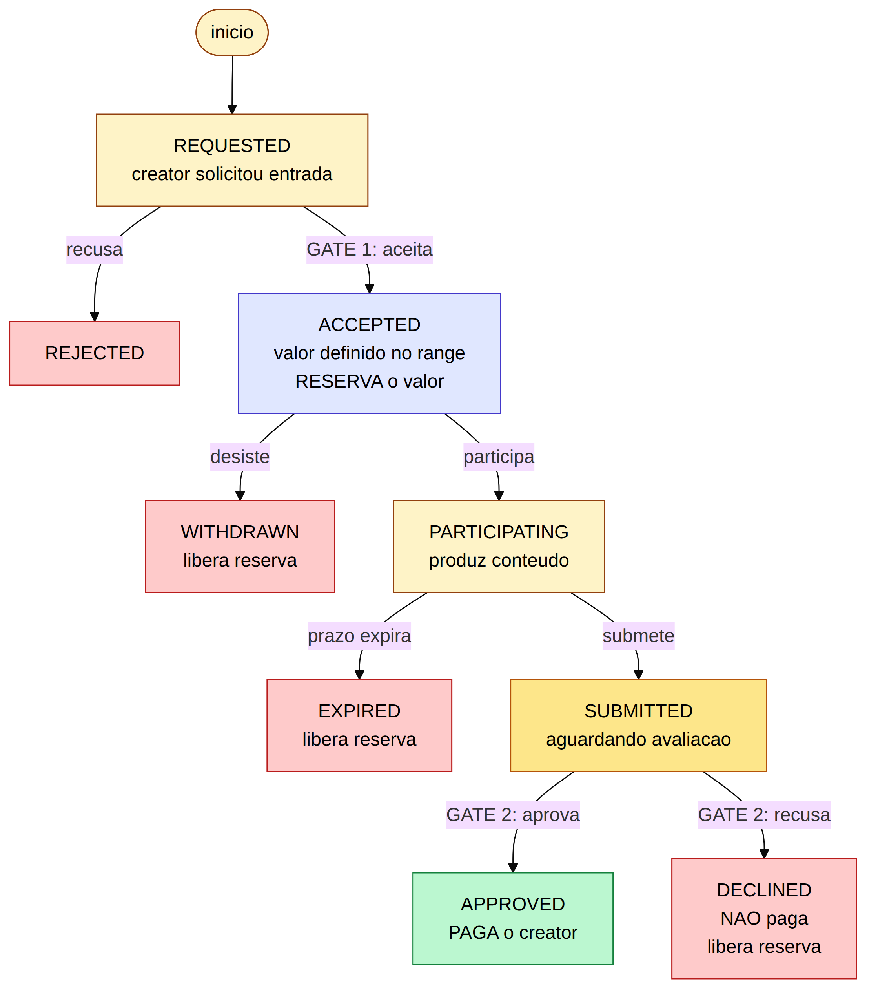
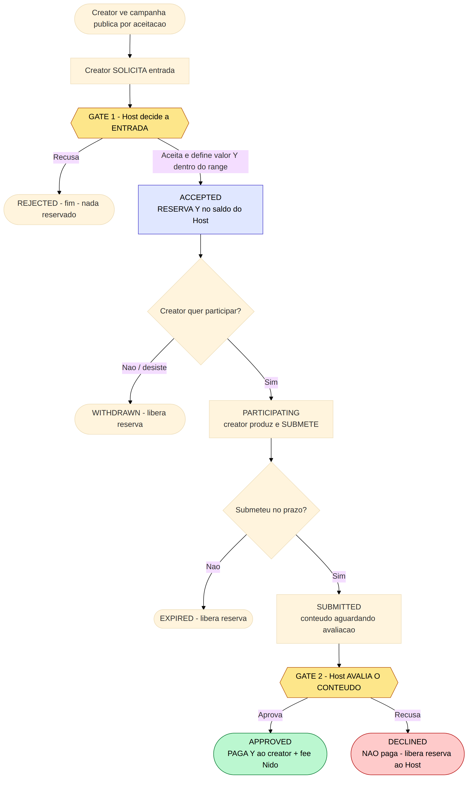
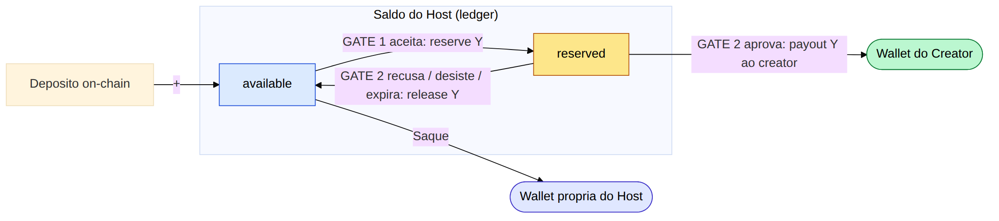
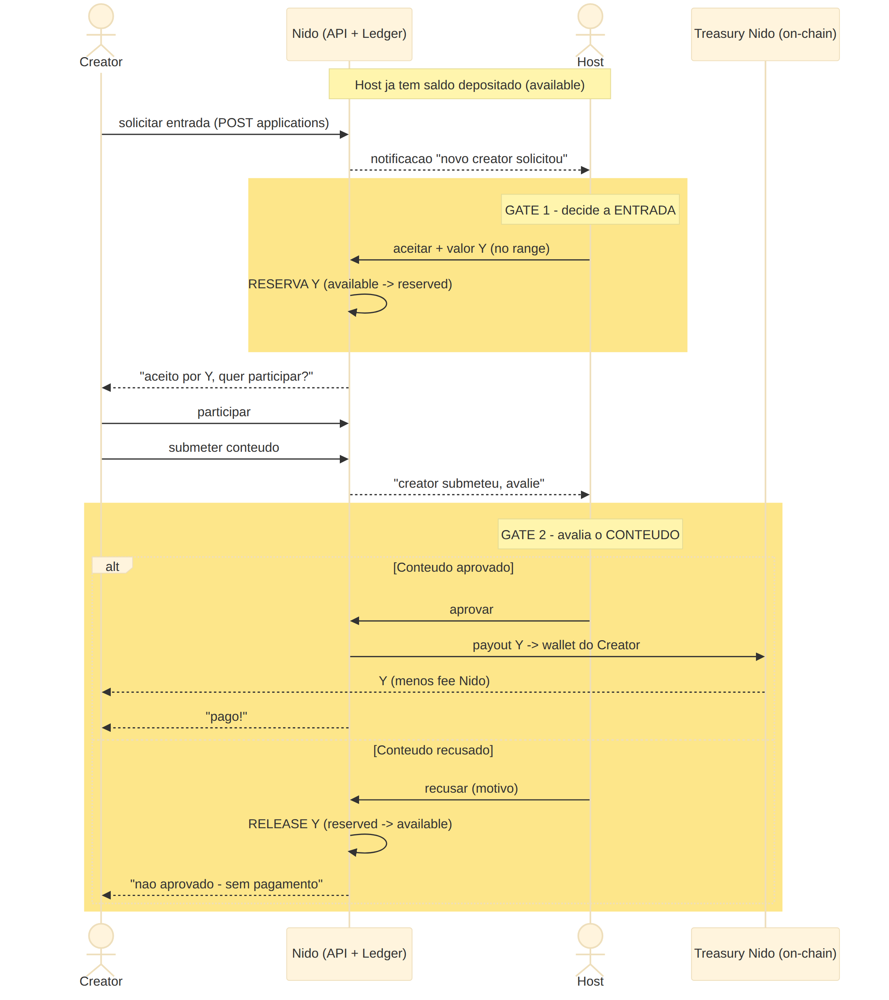
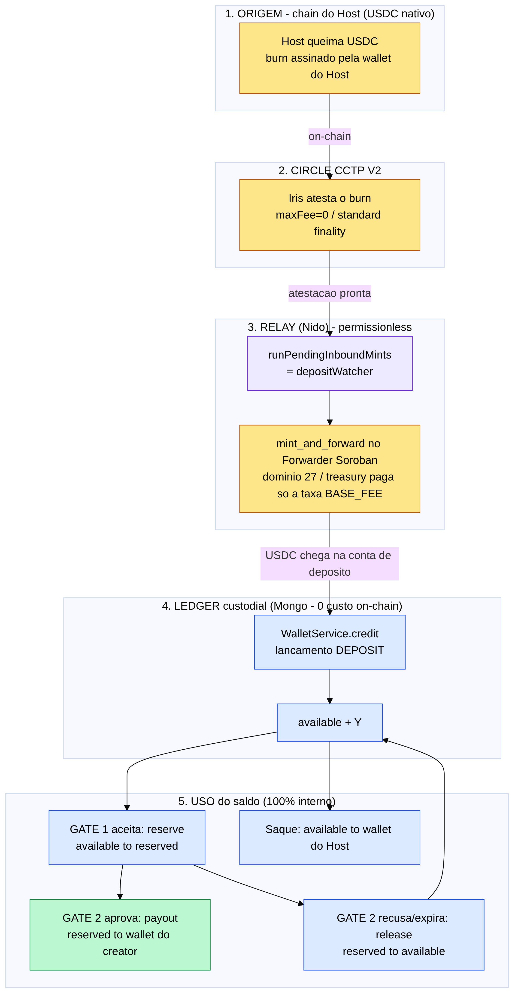

# 06 — Diagramas da lógica (versão em imagens)

> **Regra inegociável:** ser **aceito** na campanha **NÃO garante pagamento**. Existem
> **dois gates de decisão do Host**, em momentos diferentes:
>
> - **Gate 1 — Entrada:** Host aceita o creator e define o valor (apenas **reserva** o
>   dinheiro; nada é pago ainda).
> - **Gate 2 — Conteúdo:** depois do creator submeter, o Host/empresa **avalia o
>   conteúdo** e só então decide se **paga** (`APPROVED`) ou **não paga** (`DECLINED`).
>
> Se o conteúdo for recusado no Gate 2, o creator **não recebe** e o valor reservado
> **volta para o saldo disponível do Host**.

Todos os diagramas abaixo já estão **renderizados como imagem** (PNG). Os fontes
editáveis (Mermaid) ficam em [`diagramas/src/`](diagramas/src/), e há instruções de
como regerar em [`diagramas/COMO_REGERAR.md`](diagramas/COMO_REGERAR.md).

---

## 1. Máquina de estados (por creator)

Cada par (creator, campanha) percorre estes estados. Em **azul** o ponto que apenas
**reserva** o valor (Gate 1); em **amarelo** o ponto de avaliação (Gate 2); em
**verde** o único final que **paga**; em **vermelho** os finais sem pagamento.

---

## 2. Fluxo ponta a ponta com os dois gates

Os dois losangos **amarelos** (`GATE 1` e `GATE 2`) são as **duas decisões
independentes do Host**. Passar pelo Gate 1 (ser aceito) **não** implica passar pelo
Gate 2 (ser pago).

---

## 3. Efeito no saldo do Host em cada transição

- **Aceitar (Gate 1):** `available → reserved` (trava, não paga).
- **Aprovar (Gate 2):** `reserved → wallet do creator` (paga de verdade).
- **Recusar / desistir / expirar:** `reserved → available` (volta para o Host).
- **Sacar:** `available → wallet própria do Host`.

---

## 4. Sequência completa (atores + notificações)

Creator ↔ Nido ↔ Host ↔ Treasury. As duas faixas amarelas marcam o Gate 1 e o Gate 2;
no Gate 2, o bloco `alt` mostra os dois desfechos (aprovado paga / recusado libera).

---

## 5. Rail ponta a ponta: depósito cross-chain (CCTP) → saldo → uso

Mostra a rail completa: USDC nativo queimado em qualquer chain → atestação Circle Iris
→ relay permissionless (`mint_and_forward` no Forwarder Soroban) → crédito no ledger
custodial → uso interno (reserva/payout/release/saque). Em **amarelo** os passos
on-chain (custo só de taxa de tx); em **azul** o que é interno (custo zero on-chain);
em **roxo** o cron/relay; em **verde** o único momento que paga o creator.

> Leitura de custo/segurança: tudo entre o **crédito no ledger** e o **payout** é
> interno (zero on-chain). O CCTP só aparece na **fronteira do depósito**; o relay é
> non-custodial na origem (Host assina o burn) e a treasury paga apenas a taxa de tx do
> Soroban. Detalhes em [`07_INTEGRACAO_CCTP_E_DEPLOY.md`](07_INTEGRACAO_CCTP_E_DEPLOY.md).

---

## 6. Correspondência com a arquitetura

| Diagrama | Onde está no código/arquitetura |
|----------|----------------------------------|
| Gate 1 (`REQUESTED → ACCEPTED`/`REJECTED`) | endpoints `accept`/`reject` + `WalletService.reserve` ([`04`](04_API_E_DATA_MODEL.md)) |
| Gate 2 (`SUBMITTED → APPROVED`/`DECLINED`) | endpoints `approve`/`decline` + `WalletService.payout`/`release` |
| Efeito no saldo | lançamentos `CAMPAIGN_RESERVE` / `CAMPAIGN_PAYOUT` / `CAMPAIGN_RELEASE` ([`02`](02_ARQUITETURA_SALDO_HOST.md)) |
| Estados | collection `campaign_applications` ([`03`](03_ARQUITETURA_CAMPANHA_ACEITACAO.md)) |
